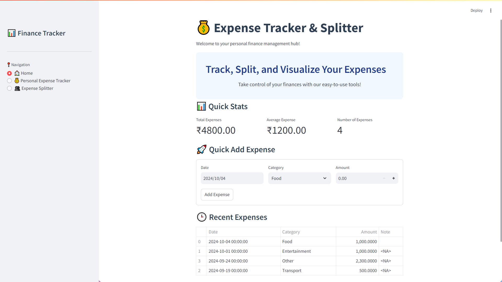
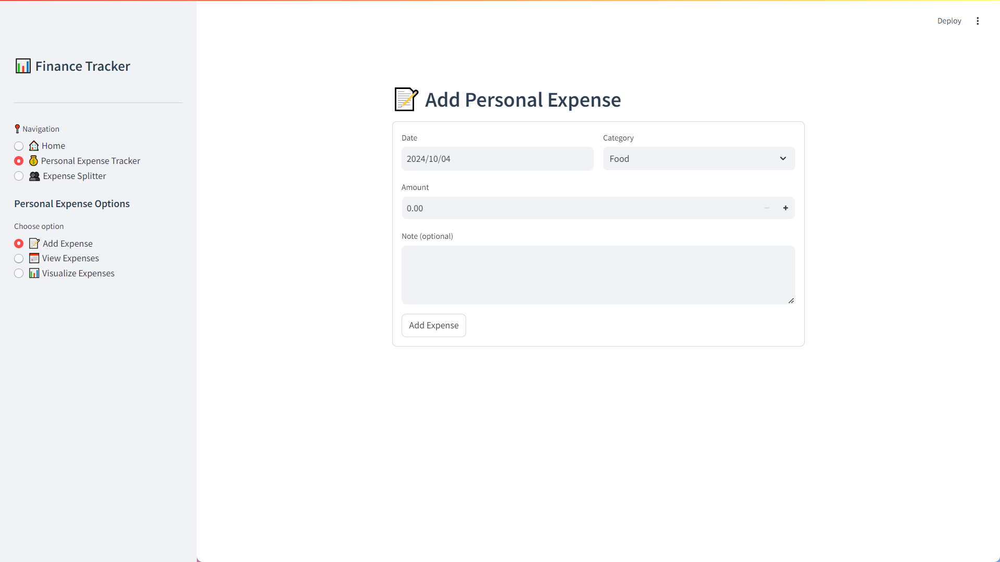
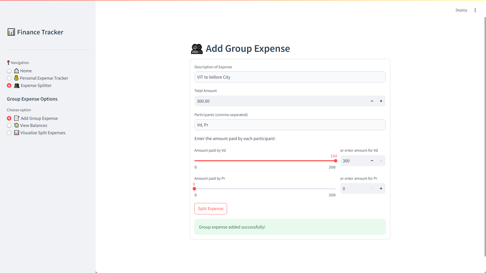

# Expense Tracker & Splitter 💰📊

[](https://www.python.org/)  
[](https://streamlit.io/)  
[](LICENSE)  

---

## 🚀 Introduction

Welcome to **Expense Tracker & Splitter** – a web-based solution designed for smart personal finance management and effortless group expense splitting!  
This application built with **Streamlit** lets you easily track expenses, visualize your spending habits, and manage shared costs with friends or colleagues.

---

## 💻 Project Setup

### Prerequisites
Before getting started, ensure you have:
- **Python 3.x** 🐍
- **Streamlit** for the web interface ✨
- **Pandas** for data manipulation 📊
- **Plotly** for interactive visualizations 📈

### Installation
1. **Install Required Libraries**  
   Open your terminal and run:
   ```bash
   pip install streamlit pandas plotly
   ```
2. **Run the Application**  
   Navigate to the project directory and execute:
   ```bash
   streamlit run app.py
   ```
   Your app will launch in your default web browser! 🌐

---

## 🌟 Application Overview

- **Personal Expense Tracker:**  
  Track and categorize your daily expenses with ease. 📜

- **Spending Visualization:**  
  Analyze your financial habits with interactive pie, bar, and line charts. 📊

- **Group Expense Splitter:**  
  Manage shared expenses and automatically calculate who owes what. 🤝

---

## ⚡ Code Structure

### Main Components:
- **Imports & Libraries:**
  ```python
  import streamlit as st
  import pandas as pd
  import plotly.express as px
  import plotly.graph_objects as go
  from datetime import datetime, timedelta
  ```
- **CSS Customization:** Enhance the visual appeal with custom styling. 🎨
- **Session State Management:** Keep your data persistent across sessions. 🔄
- **Core Functions:**
  - `home_page()`: Dashboard with quick stats and expense form.
  - `add_personal_expense()`: Enter individual expenses.
  - `view_personal_expenses()`: Filter and view your expense history.
  - `visualize_personal_expenses()`: Generate dynamic charts.
  - `add_group_expense()`: Manage shared expenses.
  - `view_group_balances()`: See who owes what.
  - `visualize_split_expenses()`: Visualize group expense splits.
- **Sidebar Navigation:** Easily switch between Home, Personal Expense Tracker, and Group Expense Splitter pages. 🔀

---

## 🎉 Features

### Home Page
- **Welcome & Quick Stats:** Get an instant overview of your finances. 🚀
- **Quick Add Expense:** Add new expenses on the fly without leaving the dashboard. ↕️

### Personal Expense Tracker
- **Expense Entry:** Record details like date, category, amount, and notes. 📜
- **History & Filtering:** View past expenses and filter by date range. 📅
- **Visualizations:**
  - **Pie Chart:** Expense distribution by category 🥧
  - **Bar Chart:** Monthly expense breakdown 📊
  - **Line Chart:** Cumulative expense trends 📈

### Group Expense Splitter
- **Shared Expense Management:** Input group expenses and record each participant's contribution. 🤝
- **Automated Balance Calculation:** See at a glance how much each person owes. 💸
- **Interactive Charts:** Visual insights into group spending and splits. 📉

---

## 📸 Screenshots

### Home Page

*Quick stats and the quick add expense feature.*

### Personal Expense Tracker
  
*Add and view your personal expenses.*

### Group Expense Splitter
  
*Manage and view shared expense balances.*

---

## 🔚 Conclusion

**Expense Tracker & Splitter** is your go-to tool for mastering personal finance and group expense management. Whether you're tracking daily expenses or splitting bills with friends, this app makes financial management a breeze! 💡✨

Feel free to contribute, suggest new features, or simply star the repository if you find it useful. Happy tracking! ⭐
